# RecoverIQ

**Turn failed payments into recovered revenue.**

Razorpay Buildathon - **AI Revenue Recovery**

RecoverIQ is a closed-loop recovery command center for failed and abandoned payments. It detects Revenue at Risk, estimates recovery probability with XGBoost, uses Gemini or deterministic diagnosis to recommend an intervention, applies deterministic financial guardrails, executes one idempotent provider action, monitors outcomes, stops immediately on success, and proves the money recovered.

> The default local experience is **Simulation - Synthetic Data - Mock Provider**. It needs no external credentials and never presents simulated money as real merchant revenue.

## Demo Flow

1. Open the payment-themed login and choose **Explore the judge demo** or **Continue with Google - Demo**.
2. Watch the recovered-value sign-in transition, then note **Revenue at Risk** in the command center.
3. Select **Run recovery**. Eight seeded cases are scored, diagnosed, prioritized, and guarded.
4. Open a case to see probability, reason codes, expected value, recommendation, and authorization.
5. Approve the INR 48,000 human-review case or simulate success on a monitoring case.
6. Watch Revenue Recovered and Net Recovered Revenue update.
7. Trigger provider failure and duplicate webhook scenarios; inspect the audit trail.
8. Open **Settings** to demonstrate persisted recovery policy, approval thresholds, notification channels, integration readiness, and the safety lab.

## Architecture

```mermaid
flowchart LR
    A[Merchant or Razorpay event] --> B[Revenue-at-risk detection]
    B --> C[XGBoost recovery probability]
    C --> D[Gemini or deterministic diagnosis]
    D --> E[LangGraph bounded workflow]
    E --> F[Deterministic guardrails]
    F --> G[Razorpay Test Mode or explicit Mock Provider]
    G --> H[Webhook and outcome monitoring]
    H --> I[Recovered or stopped state]
    I --> J[(Supabase/PostgreSQL)]
    J --> K[Dashboard metrics and audit trail]
```



Full diagrams: [docs/architecture.md](docs/architecture.md)

## Tech Stack

- React 19, TypeScript, Vite/Vinext, Tailwind CSS, shadcn/ui, Recharts
- Python 3.12, FastAPI, Pydantic, SQLAlchemy
- Supabase/PostgreSQL for deployment; isolated SQLite fallback for local/demo tests
- XGBoost + scikit-learn preprocessing/evaluation
- Gemini structured JSON with validated deterministic fallback
- LangGraph 1.2 compiled bounded state graph
- Razorpay Payment Links Test Mode adapter and signed webhooks
- Google OAuth plus explicit Judge Demo access

## Where AI Is Used

- XGBoost predicts `P(recovery)` from transaction and customer history.
- Gemini, when configured, returns a Pydantic-validated diagnosis, concise reason summary, and recommended action.
- LangGraph represents bounded workflow transitions and human approval states.

## Where AI Is Deliberately Not Used

AI cannot authorize or execute financial actions. Deterministic Python controls eligibility, maximum attempts, contact limits, cooldowns, recovery windows, duplicate links/events, idempotency, high-value approval, stopping rules, and revenue calculations. Invalid Gemini output falls back safely and is auditable.

**AI recommends. Rules authorize.**

## Actual ML Evaluation

Generated with `DEMO_SEED=42` on 10,000 synthetic records; 70/15/15 split:

| Metric | Result |
|---|---:|
| ROC-AUC | 0.7791 |
| PR-AUC | 0.8156 |
| Precision | 0.6772 |
| Recall | 0.9358 |
| F1 | 0.7857 |
| Brier score | 0.1862 |
| Selected threshold | 0.34 |

These values come from `ml/artifacts/metrics.json`. They are synthetic evaluation results, not production merchant performance. See [docs/ml-evaluation.md](docs/ml-evaluation.md).

## Run Locally

### Frontend Dashboard

```bash
npm ci
npm run dev
```

Open `http://localhost:5173`.

### FastAPI Backend

```bash
python -m venv .venv
source .venv/bin/activate  # Windows: .venv\Scripts\activate
pip install -r backend/requirements.txt
python scripts/seed_demo.py
cd backend
uvicorn app.main:app --reload --port 8000
```

Open API docs at `http://localhost:8000/docs`.

## Train And Test

From the repository root:

```bash
python -m ml.training.train
npm run build
npm test
python -m pytest backend
python scripts/run_demo_evaluation.py
```

## Provider Modes

Default local mode:

```env
PAYMENT_PROVIDER=mock
```

Razorpay Test Mode:

```env
PAYMENT_PROVIDER=razorpay
RAZORPAY_KEY_ID=rzp_test_...
RAZORPAY_KEY_SECRET=...
RAZORPAY_WEBHOOK_SECRET=...
```

Gemini: set `GEMINI_API_KEY=...`. See [docs/razorpay-setup.md](docs/razorpay-setup.md) and [docs/deployment.md](docs/deployment.md).

Authentication supports explicit Judge Demo access for deterministic review and real Google OAuth when `NEXT_PUBLIC_GOOGLE_CLIENT_ID` is configured. The email/password, new-workspace, and reset screens are demo-session flows, not production identity management. See [docs/authentication.md](docs/authentication.md).

The Settings control plane writes policy through `/api/demo/settings`: automatic recovery, human-approval threshold, maximum attempts, and alert channels are validated by the application engine. The next recovery batch reads that server policy, and the live policy-impact preview shows how many current cases will execute automatically, pause for review, or be safely suppressed. Integration checks remain honestly labeled as demo/fallback until provider keys are configured.

After downloading, follow [docs/after-download-checklist.md](docs/after-download-checklist.md). Run `python scripts/check_setup.py` after every environment change; it validates provider mode, database choice, and required key presence without printing secrets. The Audit trail can export a reviewable CSV containing current revenue metrics and every visible recovery event.

## Deployment

- Frontend: Vercel
- Backend: Render using [render.yaml](render.yaml)
- Database: Supabase/PostgreSQL using [alembic/versions/0001_initial.sql](alembic/versions/0001_initial.sql)
- External services: Razorpay Test Mode, Gemini, Google OAuth

Do not commit `.env`; configure secrets in Vercel and Render environment variables.

## Reliability And Safety

- Idempotency key per case/action/attempt
- HMAC-SHA256 webhook verification and stable event deduplication
- No action after success, cancellation, refund, or outside the recovery window
- Two-attempt/two-contact ceilings and contact cooldown
- Human approval above a configurable INR 25,000 threshold
- Structured audit records for every material decision/transition
- Explicit Mock Mode for deterministic demos

## Repository Map

```text
app/                 React dashboard and deployed demo API
backend/app/         FastAPI, SQLAlchemy, providers, agents, graph, guardrails
backend/tests/       API, ML, workflow, webhook, and failure tests
ml/training/         reproducible data generation and XGBoost training
ml/artifacts/        fitted pipeline, metrics, and feature metadata
alembic/versions/    PostgreSQL-compatible initial migration
docs/                architecture, API, auth, deployment, demo, and evaluation notes
scripts/             setup checks, demo seeding, and evaluation helpers
```

## Limitations

- Results are synthetic simulation outputs, not production merchant outcomes.
- Real Razorpay and Gemini calls require merchant test credentials/API key.
- Supabase/PostgreSQL is the intended deployed database; SQLite is retained for isolated local/demo testing.
- Authentication is suitable for a single demo merchant and Google OAuth verification. Production multi-tenant authorization remains an integration boundary.

## Future Scope

Calibrated production models, per-merchant cost policies, durable LangGraph checkpoints, channel optimization, experiment governance, and merchant role-based access.
