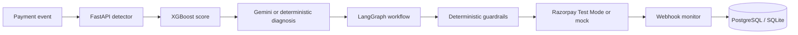

# RecoverIQ

**Turn failed payments into recovered revenue.**

Razorpay Buildathon · **AI Revenue Recovery**

RecoverIQ is a closed-loop recovery command center for failed and abandoned payments. It detects revenue at risk, estimates recovery probability with XGBoost, uses structured AI diagnosis to recommend an intervention, applies deterministic financial guardrails, executes one idempotent provider action, monitors outcomes, stops immediately on success, and proves the money recovered.

> The default experience is **Simulation · Synthetic Data · Mock Provider**. It needs no external credentials and never presents simulated money as real merchant revenue.

## Demo flow

1. Open the payment-themed login and choose **Explore the judge demo** or **Continue with Google · Demo**.
2. Watch the recovered-value sign-in transition, then note **Revenue at Risk** in the command center.
3. Select **Run recovery**. Eight seeded cases are scored, diagnosed, prioritized, and guarded.
4. Open a case to see probability, reason codes, expected value, recommendation, and authorization.
5. Approve the ₹48,000 human-review case or simulate success on a monitoring case.
6. Watch recovered and net revenue update.
7. Trigger provider failure and duplicate webhook scenarios; inspect the audit trail.
8. Open **Settings** to demonstrate persisted recovery policy, approval thresholds, notification channels, integration readiness, and the recruiter-friendly safety lab.

## Architecture



Full diagrams: [docs/architecture.md](docs/architecture.md)

## Tech stack

- React 19, TypeScript, Vite/Vinext, Tailwind CSS, shadcn/ui, Recharts
- Python 3.12, FastAPI, Pydantic, SQLAlchemy
- PostgreSQL/Supabase compatible; SQLite zero-config fallback
- XGBoost + scikit-learn preprocessing/evaluation
- Gemini structured JSON with validated deterministic fallback
- LangGraph 1.2 compiled bounded state graph
- Razorpay Payment Links Test Mode adapter and signed webhooks

## Where AI is used

- XGBoost predicts `P(recovery)` from transaction and customer history.
- Gemini, when configured, returns a Pydantic-validated diagnosis, concise reason summary, and recommended action.
- LangGraph represents bounded workflow transitions and human approval states.

## Where AI is deliberately NOT used

AI cannot authorize or execute financial actions. Deterministic Python controls eligibility, maximum attempts, contact limits, cooldowns, recovery windows, duplicate links/events, idempotency, high-value approval, stopping rules, and revenue calculations. Invalid Gemini output falls back safely and is auditable.

## Actual ML evaluation

Generated with `DEMO_SEED=42` on 10,000 synthetic records; 70/15/15 split:

| Metric | Result |
|---|---:|
| ROC-AUC | 0.7791 |
| PR-AUC | 0.8156 |
| Precision | 0.6772 |
| Recall | 0.9358 |
| F1 | 0.7857 |
| Brier score | 0.1862 |
| Selected threshold | 0.34 |

These are generated artifacts in `ml/artifacts/metrics.json`, not hand-entered claims. See [docs/ml-evaluation.md](docs/ml-evaluation.md).

## Run locally

### Dashboard

```bash
npm ci
npm run dev
```

Open `http://localhost:5173`.

### FastAPI backend

```bash
python -m venv .venv
source .venv/bin/activate  # Windows: .venv\Scripts\activate
pip install -r backend/requirements.txt
python scripts/seed_demo.py
cd backend
uvicorn app.main:app --reload --port 8000
```

Open API docs at `http://localhost:8000/docs`.

### Docker

```bash
docker compose up --build
```

## Train and test

```bash
python -m ml.training.train
cd backend && python -m pytest
cd .. && npm run build
python scripts/run_demo_evaluation.py
```

## Provider modes

Default: `PAYMENT_PROVIDER=mock`.

Razorpay Test Mode:

```env
PAYMENT_PROVIDER=razorpay
RAZORPAY_KEY_ID=rzp_test_...
RAZORPAY_KEY_SECRET=...
RAZORPAY_WEBHOOK_SECRET=...
```

Gemini: set `GEMINI_API_KEY=...`. See [docs/razorpay-setup.md](docs/razorpay-setup.md) and [docs/deployment.md](docs/deployment.md).

Authentication keeps explicit local demo access for judging while `Continue with Google` uses a configured Google OAuth client. Email sign-in, new-account, reset-password, session persistence, and sign-out flows are included. Configure production auth hardening as described in [docs/authentication.md](docs/authentication.md).

The Settings control plane writes policy through `/api/demo/settings`: automatic recovery, human-approval threshold, maximum attempts, and alert channels are validated by the application engine. The next recovery batch reads that server policy, and the live policy-impact preview shows how many current cases will execute automatically, pause for review, or be safely suppressed. Integration checks remain honestly labeled as demo/fallback until provider keys are configured.

After downloading, follow [docs/after-download-checklist.md](docs/after-download-checklist.md). Run `python scripts/check_setup.py` after every environment change; it validates provider mode, database choice, and required key presence without printing secrets. The Audit trail can export a judge-ready CSV containing current revenue metrics and every visible recovery event.

## Reliability and safety

- Idempotency key per case/action/attempt
- HMAC-SHA256 webhook verification and stable event deduplication
- No action after success, cancellation, refund, or outside the recovery window
- Two-attempt/two-contact ceilings and contact cooldown
- Human approval above a configurable ₹25,000 threshold
- Structured audit records for every material decision/transition
- Safe mock modes for missing credentials

## Repository map

```text
app/                 React dashboard and deployed demo API
backend/app/         FastAPI, SQLAlchemy, providers, agents, graph, guardrails
backend/tests/       API, ML, workflow, webhook and failure tests
ml/training/         reproducible data generation and XGBoost training
ml/artifacts/        fitted pipeline, metrics and feature metadata
alembic/versions/    PostgreSQL-compatible initial migration
docs/                architecture, API, pitch, deployment and build record
```

## Limitations

- Results are synthetic simulation outputs, not production merchant outcomes.
- Real Razorpay and Gemini calls require the merchant's test credentials/API key.
- SQLite is the zero-setup default; multi-instance production should use PostgreSQL and a durable workflow checkpointer/queue.
- Authentication is a clearly labeled single demo merchant; production tenant authentication remains an integration boundary.

## Future scope

Calibrated production models, per-merchant cost policies, durable LangGraph checkpoints, channel optimization, experiment governance, and merchant role-based access.
