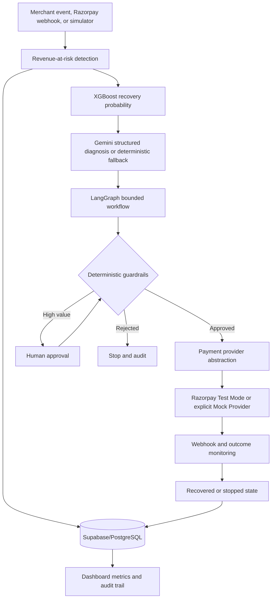
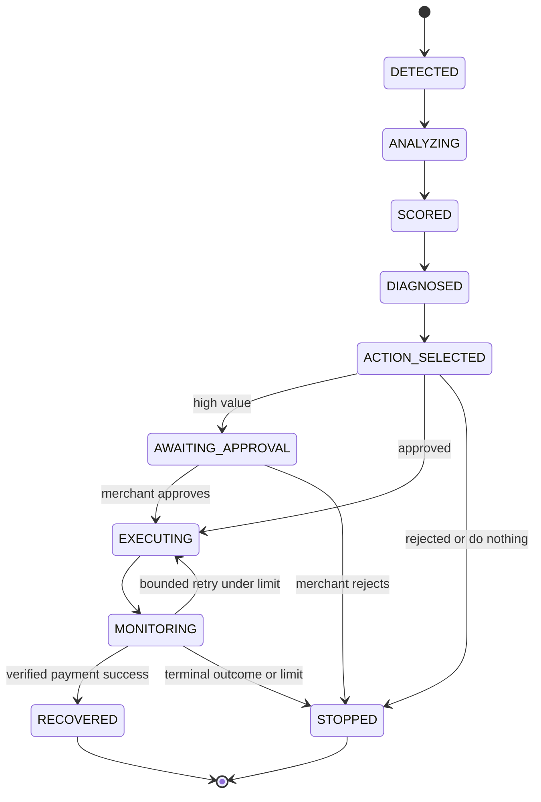
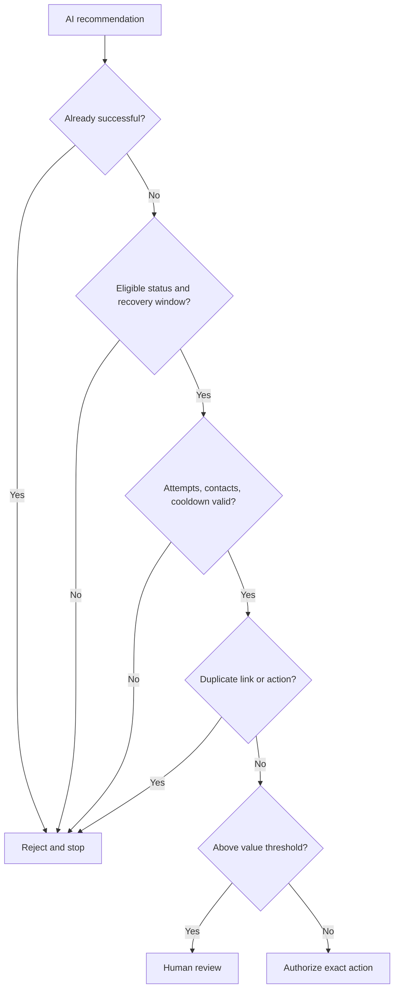
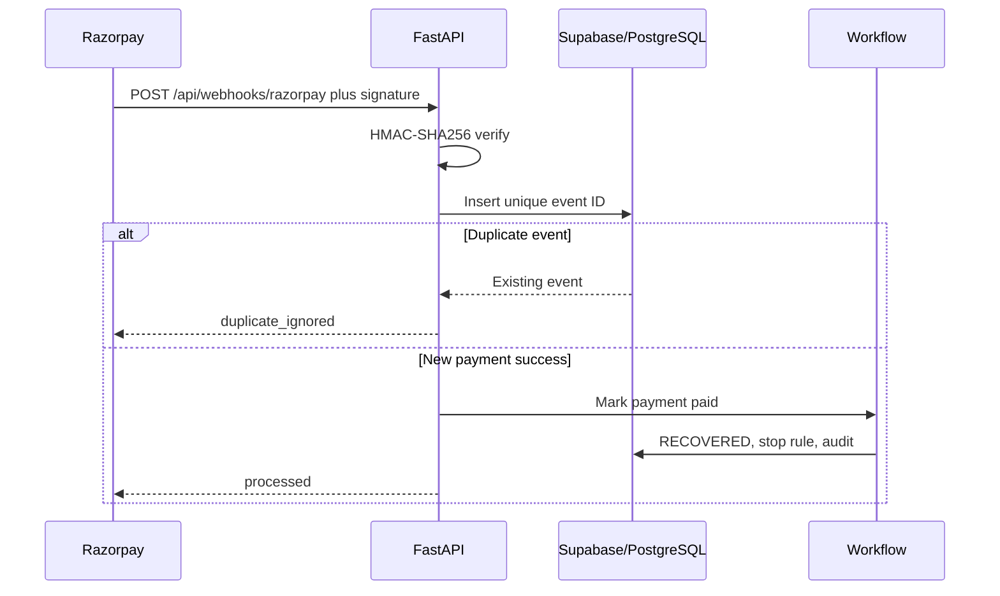

# RecoverIQ Architecture

## System Flow

RecoverIQ's operating principle is simple:

**AI recommends. Rules authorize.**

The LLM never receives provider credentials, cannot bypass financial guardrails, and cannot independently execute unrestricted financial actions. Provider invocation is a typed server-side method reached only after deterministic authorization.

## Bounded Recovery Workflow

## Guardrail Execution

## Verified Webhook Flow

The frontend also includes a Vercel-compatible demo API for the browser demonstration. The authoritative provider, workflow, database, and webhook implementation lives in the FastAPI backend for Render.
