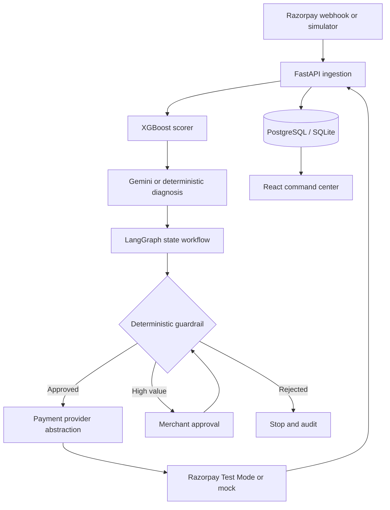
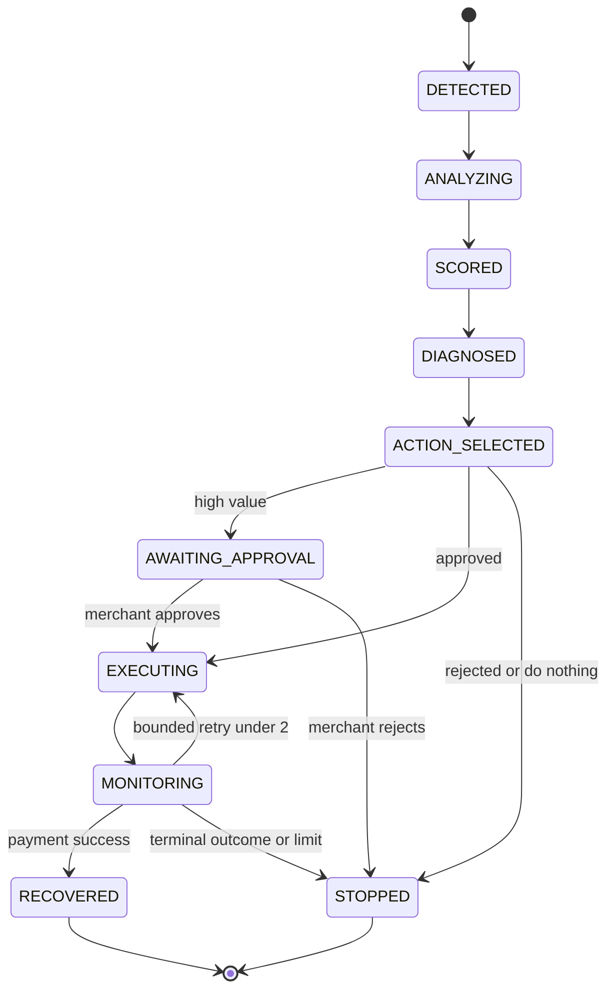
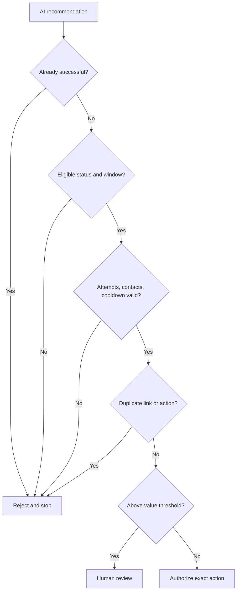
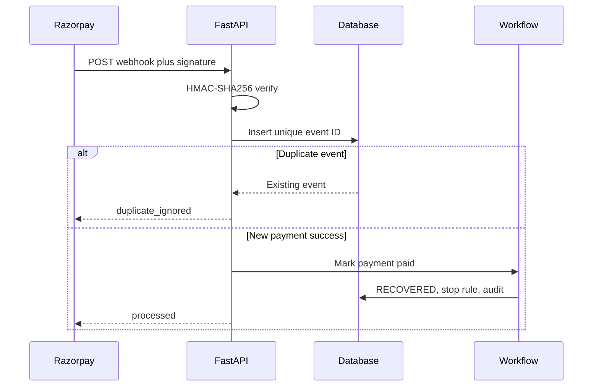

# RecoverIQ architecture

## System

## Bounded recovery workflow

## Guardrail execution

## Verified webhook flow

The LLM never receives provider credentials or arbitrary execution access. Provider invocation is a typed server-side method reached only after deterministic authorization.
